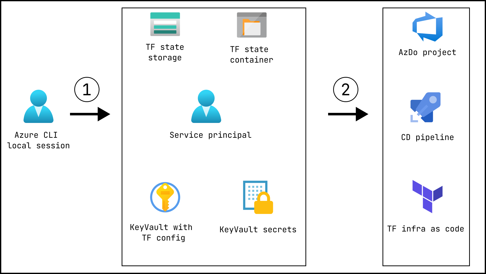

# Infrastructure and CD automation

This document describes how to automate infrastructure and application deployment via azure pipelines and azure devops.

## General Idea

### Step 1

- Log in to Azure CLL on local PC
- Create azure storage account `$STORAGE_ACCOUNT_NAME`
- Create azure storage container `$STORAGE_CONTAINER_NAME`
- Create service principal over subscription with Contributor role `$SERVICE_PRINCIPAL_NAME`
- Create azure key vault `$KEY_VAULT_NAME`
- Assign `$SERVICE_PRINCIPAL_NAME` to `$KEY_VAULT_NAME` with `get` and `list` permissions
- Create secrets in `$KEY_VAULT_NAME`
    - kv-tf-state-blob-account
    - kv-tf-state-blob-container
    - kv-tf-state-sas-token
    - kv-arm-subscription-id
    - kv-arm-client-id
    - kv-arm-client-secret
    - kv-arm-tenant-id
    - prefix

### Step 2

- Create service principal `$SERVICE_PRINCIPAL_NAME` service connection in Azure DevOps
- Add KeyVault task to terraform infrastructure deploy pipeline